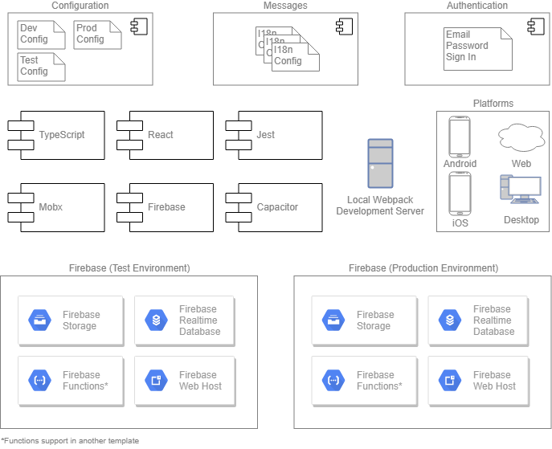

# Platform Agnostic TypeScript Template (PATT)

[](https://travis-ci.org/naishtech/platform-agnostic-typescript-template)

PATT is a template for multi-platform TypeScript applications with serverside authentication, database and storage support.

PATT can span mulitple devices natively including Web, Desktop, Android and iOS.

PATT has built in services to help you authenticate users, gather analytics, connect to an online database and upload files to online storage.

PATT is free/open source. Enjoy.

If you find PATT useful, please consider donating:

<a href="https://www.paypal.com/cgi-bin/webscr?cmd=_donations&business=LPZXWY9YRQVXC&currency_code=AUD&source=url" target="_blank"></a>

# Table of contents

1. [ Features ](#features)
2. [ Requirements ](#requirements)
3. [ Modules ](#dependencies)
4. [ Setup ](#setup)
5. [ Getting Started ](#getting-started)
6. [ Hosting ](#hosting)
7. [ Sample Project ](#sample-project)
8. [ Firebase Functions ](#firebase-functions)

<a name="features"></a>

# 1. Features:

- Android, iOS, Desktop and Web support.
- Plain email/password authentication.
- Google Analytics support.
- Local, Test and Production environment configurations.
- Firebase hosting, database and storage support. Firebase Functions with Typscript not included (there's a [template](https://github.com/firebase/functions-samples/tree/master/typescript-getting-started) for that already)
- Multilingual i18n support.



<a name="requirements"></a>

# 2. Requirements:

- [NodeJS/npm](https://nodejs.org/en/)
- [Android Studio](https://developer.android.com/studio) (Optional for building Android Apps)
- [XCode](https://developer.apple.com/xcode) (Optional for building iOS Apps).

<a name="modules"></a>

# 3. Modules:

- PATT includes the following main dependencies:

- [Capacitor](https://capacitor.ionicframework.com/)
- [Firebase](https://firebase.google.com/)
- [Google Analytics](https://analytics.google.com/analytics/web/)
- [Webpack](https://webpack.js.org/)
- [Jest](https://jestjs.io/)
- [Mobx](https://github.com/mobxjs/mobx)
- [TypeScript](https://www.typescriptlang.org/) 
- [tslint](https://palantir.github.io/tslint/)
- [Scss](https://sass-lang.com/)
- [stylelint](https://stylelint.io/)

<a name="setup"></a>

# 4. Setup:

## Install your IDE's:

1. Install [VSCode](https://code.visualstudio.com/).

2. Install [NodeJS/npm](https://nodejs.org/en/).

3. Optionally, for Android support, install [Android Studio](https://developer.android.com/studio).
    - Make sure your JAVA_HOME and ANDROID_SDK_ROOT environment variables are set correctly.
    - Make sure you setup a Virtual Device (you can do this as part of the android launch, see below).

4. Optionally, for iOS support, install [XCode](https://developer.apple.com/xcode/).

5. Open a command prompt and change directory to your project's root directory.

6. Execute `npm install`.

<a name="getting-started"></a>

# 5. Getting Started:

### Building the sample web app:

`npm run build:dev`

- Notes:
    - Compiled files will be in the `dist` directory.
    - [Capacitor](https://capacitor.ionicframework.com/) works by copying your web application bundle (HTML / JavaScript / CSS) to other target platforms (IOS/Android/Desktop). The above script will build your web application using the [Webpack](https://webpack.js.org/) build configuration in `/webpack/dev.js`, likewise `npm run build:test` and `npm run build:prod` will build using the [Webpack](https://webpack.js.org/) build configuration in `/webpack/test.js` and `/webpack/prod.js` respectively.

### Running tests:

`npm run test`

- Notes:
    - This template includes Jest as a unit testing tool. A sample test rendering the `<App/>` component can be found in `/src/__tests__/App.test.tsx`.
    - All tests should be placed under `/src/__tests__/`
    - A coverage report will be added to `/src/__coverage__/`

### Starting the local web development server:

`npm run start`

- Notes:
    - Once you have built your application, this command will start a local web host at http://localhost:8080
    - In order to log in to the sample app provided you will need to create a test Firebase server, see [Hosting](#hosting). After you have set up your test server you can copy the `firebase` settings to your local `static/config/dev/config.json` file.
    - In order use the sample shakeout tests you will need to setup the appropriate rules in Firestore and Storage to allow read write access for logged in users.
    - The local webpack development server comes with an inbuilt hot loader and will reload as you make changes to your source code.

### Starting the local Android emulator:

`npm run start:android`

- Notes:
    - Make sure you have installed Android Studio as per [Getting Started](#getting-started).
    - If this is the first time you have opened the project in Android Studio it will prompt you for import. Just select the defauls and continue.
    - Once Android Studio has started the project should automatically build, once built you can execute it via the Run menu.

### Starting the local iOS emulator:

`npm run start:ios`

- Notes:
    - Make sure you have installed XCode as per [Getting Started](#getting-started).
    - If this is the first time you have opened the project in XCode it will prompt you for import. Just select the defauls and continue.
    - Once XCode has started the project should automatically build, once built you can execute it via the Run button.

### Starting the desktop application:

`npm run start:desktop`

- Notes:
    - Electron support for Capacitor is currently in preview, and lags behind iOS, Android, and Web support.
    - First time starting this might take a while, be patient

<a name="hosting"></a>

# 6. Hosting

## Deploying to a Firebase test server

- This template provides configuration for a firebase test server.

1. First, create a new [Firebase](https://firebase.google.com) project.
2. Make sure you have configured your signin method(s) on your Firebase project (under the [firebase console](https://console.firebase.google.com) go to Authentication -> Signin-Method). If you want use Firestore or Storage, make sure you have configured your access rights for them.
3. Add the project id (found in your Firebase Project Settings) for your test Firebase project under the `test` field in `.firebaserc`:

 
```
 {
  "projects": {
...
    "test": "test-firebase-project",
...
  }
}
```

4. Get your project settings (under the [firebase console](https://console.firebase.google.com) go to Settings -> Project Settings) and add the relevant configuration to the following file.

`/static/config/test.json`

```
...
        "firebase" : {
            "apiKey": "your_api_key",
            "authDomain": "your.firebaseapp.com",
            "databaseURL": "https://your.firebaseio.com",
            "projectId": "your-project-id",
            "storageBucket": "your.appspot.com",
            "messagingSenderId": "123456789012"
        }
...
```

5. Once you have configured as per above, run the following:

`npm run deploy:test`

## Deploying to a Firebase prod server

- This template provides configuration for a firebase production server.

1. First, create a new [Firebase](https://firebase.google.com) project.
2. Make sure you have configured your signin method(s) on your Firebase project (under the [firebase console](https://console.firebase.google.com) go to Authentication -> Signin-Method). If you want use Firestore or Storage, make sure you have configured your access rights for them.
3. Add the project id (found in your Firebase Project Settings) for your prod Firebase project under the `prod` field in `.firebaserc`:

 
```
 {
  "projects": {
...
    "prod": "prod-firebase-project",
...
  }
}
```

4. Get your project settings (under the [firebase console](https://console.firebase.google.com) go to Settings -> Project Settings) and add the relevant configuration to the following file.

`/static/config/prod.json`

```
...
        "firebase" : {
            "apiKey": "your_api_key",
            "authDomain": "your.firebaseapp.com",
            "databaseURL": "https://your.firebaseio.com",
            "projectId": "your-project-id",
            "storageBucket": "your.appspot.com",
            "messagingSenderId": "123456789012"
        }
...
```

5. Once you have configured as per above, run the following:

`npm run deploy:prod`

<a name="sample-project"></a>

# 7. Sample Project

## Sample Components

- `src/components/database/DatabaseView.tsx`: Simple data table connected to a Firebase Firestore database.
- `src/components/database/DatabaseState.ts`: Database state.
- `src/components/login/AccountMenu.tsx`: Simple account menu with a login link. Clicking the link will send the user to Login.tsx.
- `src/components/login/Login.tsx`: Contains the FirebaseUI plain email/password login/sign up button.
- `src/components/login/LoginState.ts`: Login state (contains unsubscribe functions).
- `src/components/upload/Upload.tsx`: Simple upload connected to Firebase storage.
- `src/components/upload/Upload.ts`: Upload state.
- `src/App.tsx`: Main container with configured routes (with dev hot loader support).
- `src/Home.tsx`: Simple home screen showing PATT service configuration and shakeout tests.
- `index.tsx`: Index page with dev hot loader support.


## Services

- The included services are under the following directory: `/src/services/`. 
- Note: Services are executed in the following order:

    1. Configuation.ts
    2. Messages.ts

### Built in services:

- Configuration.ts
    - Configuration service supporting dev, test and prod configurations under `src/static/config/`;
    - Messages.json are loaded via XHR Request (see Messages.ts)
    - The dev, test and prod configuration is deployed with the relative npm script targets `npm deploy:<dev|test|prod>`
    - Example usage:

    ```
    import {Configuration} from 'Configuration';

    /* 
        Get the storage bucket string from config.
    */
    
    const storageBucket = Configuration.getConfig('firebase').storageBucket;

    ```


- Messages.ts

    - Messages are loaded asynchonously from the server, see Configuration.configure();
    - Example Usage:


<a name="firebase-functions"></a>

# 8. Adding firebase functions support

- Firebase functions should be engineered in a different project/repository. If this project is of interest we will consider releasing our firebase functions template, until then, here's a decent firebase TypeScript template to get you started:

https://github.com/firebase/functions-samples/tree/master/typescript-getting-started


